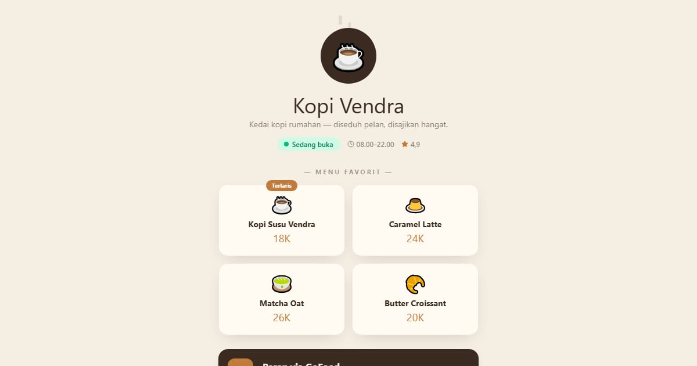

# Kopi Vendra — Pesan & Kunjungi

Link in bio kedai Kopi Vendra: menu favorit, pesan lewat GoFood/WhatsApp, atau mampir langsung.

**Demo live:** https://linkinbio-vendra.vercel.app



> Template link-in-bio dengan persona fiktif.

## Konsep

Persona Kopi Vendra, kedai kopi. Tampil seperti etalase toko: status buka/tutup mengikuti jam, grid menu berharga, tombol GoFood dan WhatsApp, serta animasi uap kopi.

## Halaman

`/`

## Teknologi

- Next.js 15.5 (App Router) dan React 19
- Tailwind CSS v4
- JavaScript
- Lucide (ikon)
- Font: DM Serif Display, Plus Jakarta Sans (next/font)
- SEO: metadata per halaman, Open Graph, JSON-LD, sitemap.xml, dan robots.txt

## Menjalankan secara lokal

```bash
npm install
npm run dev
```

Buka http://localhost:3000. Untuk build produksi: `npm run build` lalu `npm start`.

---

Bagian dari koleksi 12 template link-in-bio di [PortalBio](https://portal-bio-neon.vercel.app). Dibuat oleh [PintuWeb](https://pintuweb.com), jasa pembuatan website.
